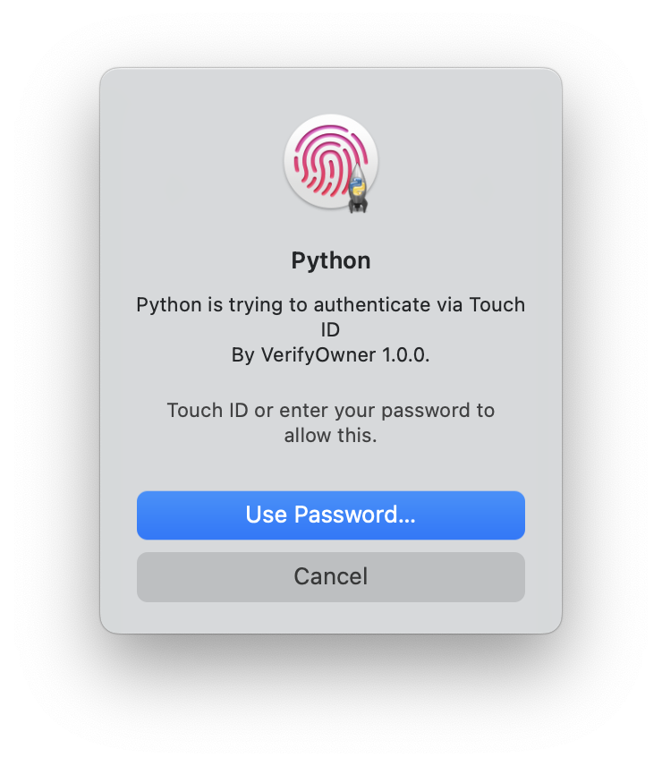

# VerifyOwner - Python Touch ID module

This module provide a method to invoke Touch ID authentication on MacOS. You can easily integrate VerifyOwner in your project.

## Example



## Usage

```python
>>> import VerifyOwner
>>> VerifyOwner.VerifyOwner('authenticate via Touch ID')
True
>>>
```


## Installation

```shell
git clone https://github.com/Aliebc/VerifyOwner
cd VerifyOwner
pip3 install .

```
